## Vergangenheit
- Funkenschinder erschien auf der Insel und ließ sich in der Sternwarte nieder
- Funkenschinden griff Drachenruh an um die Knochen von Astalagan zu rauben

## Tag 1

| Uhrzeit       | Event                                 |
| ------------- | ------------------------------------- |
| 06:00         | Ankunft der Charaktere in Drachenruh  |
| 07:00         | Erster Luftkampf zwischen den Drachen |
| 08:00 - 16:00 | Erste Location aufsuchen              |
| 22:00 - 06:00 | Lange Rast                            |

```mermaid
gantt
	dateFormat HH:mm
	axisFormat %H:%M
	section Gruppe
		Drachenruh: done, a1, 2023-01-01 06:00, 2h
		Anreise Seegrashöhlen: done, a2, after a1, 3h
		Seegrashöhlen: done, a3, after a2, 2h
		Rückreise Seegrashöhlen: done, a4, after a3, 3h
		Lange Rast: done, a5, after a4, 8h
		Anreise Kompassrose: done, a6, 2023-01-02 02:00, 3h
		Kompassrose: active, a7, after a6, 2h
		Rückreise Kompassrose: a8, after a7, 3h
		Lange Rast: a9, after a8, 8h
		Anreise Sternwarte: a10, after a9, 3h
	section Funkenschinder
		Luftkampf mit Aidron: done, milestone, b1, 2023-01-01 07:00, 10m
		Lange Rast: done, b2, after b1, 8h
		Angriff auf Drachenruh: done, milestone, b3, after b2, 30m
		Lange Rast: done, b4, after b3, 8h
		Aidron wird besiegt: milestone, b5, 2023-01-02 10:00, 10m
		Lange Rast: b6, after b5, 8h
		Knochen von Sharruth: milestone, b7, 2023-01-02 21:00, 10m
		Ritual: milestone, b10, 2023-01-02 22:00, 10m
	section Runara
		Kristallschlüssel herstellen: c1, 2023-01-02 06:00, 12h	
	section Mekk und Minn
		Knochen von Clyssavar: d1, 2023-01-02 06:00, 6h
```

- Aidron und Funkenschinder ziehen sich nach dem Kampf zurück um zu Rasten
- Funkenschinder schickt seine Kobolde aus um die Knochen der weiteren Drachen zu bergen (Charaktere finden Spuren in den beiden Locations)

## Tag 2

| Uhrzeit       | Event                                  |
| ------------- | -------------------------------------- |
| 06:00 - 14:00 | Zweite Location aufsuchen              |
| 10:00         | Zweiter Luftkampf zwischen den Drachen |
| 16:00 - 19:00 | Aufbruch Sternwarte                    |
| 00:00         | Ankunft des Königstöter-Kometen        |

## Tag 3
- Aidron unterliegt Funkenschinder und wird im Turm der Sternwarte eingekerkert

## Zeitaufwände

| Aktivität                    | Zeit |
| ---------------------------- | ---- |
| Lange Rast                   | 8h   |
| Kurze Rast                   | 1h   |
| Reise                        | 2-3h |
| Random Encounter             | -    |
| Rollenspiel                  | 1h   |
| [[Seegrashöhlen]]            | 6-8h |
| [[Verfluchtes Schiffswrack]] | 6-8h |
| [[Sternwarte]]               | 4h   |